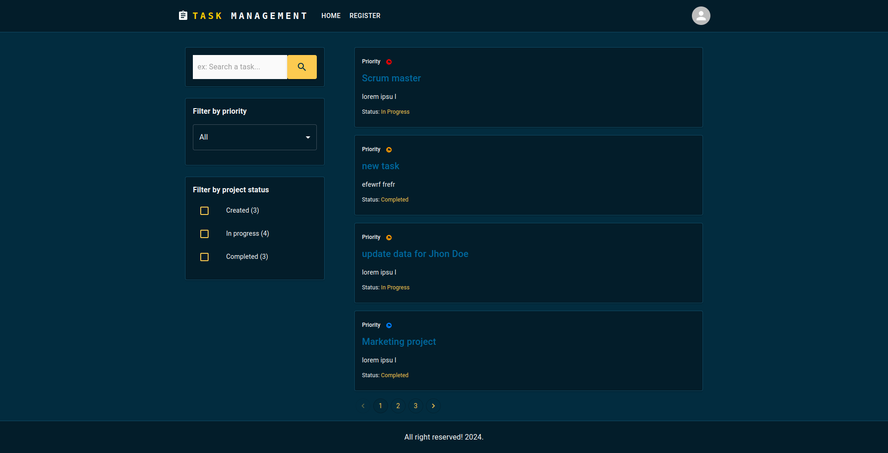

# Fullstack task management with Material UI, nodejs, typescript & mongodb

# Features:
##### - HOC (High Order Component)
##### - Admin & user Dasboard;
##### - React, Typescript, Material UI, 
##### - Redux toolkit, 
##### - Show & hide sidebar,
##### - Notification
##### - Assign task to a particular user,
##### - Search & filter,
##### - Form validation (Formik & Yup)
##### - Pagination, Datagrid
##### - Responsiveness, etc

